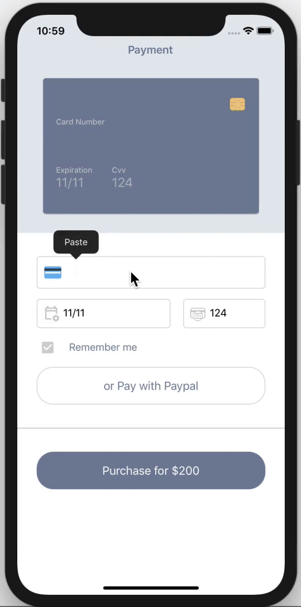

# Sample Payment App UI with Prism.MAUI!

As the title says, this is a sample credit card payment screen is written using .NET MAUI and the [Prism Library](https://github.com/PrismLibrary) which runs on Windows, Android, iOS, and Tizen.

The sample app leverages [Prism.MAUI](https://github.com/PrismLibrary/Prism.Maui) for its easy-to-use Navigation Service for passing information and Dependency Injection with DryIOC. The sample also makes use of XAML Behaviors, dynamic styling, and shared PNG resources.

Featured On:
* [.NET MAUI Good Looking UI](https://github.com/jsuarezruiz/dotnet-maui-showcase)
* [Snppts.dev - Credit Card Payment UI](https://www.snppts.dev/snippet/credit-card-payment-ui)


### Prism.Maui update:

```cs
// Previously, Prism.Maui used:
.UsePrismApp<App>(prism => {... })

// Now, you define it as follows
.UseMauiApp<App>()
.UsePrism(prism => { ... })
```

<p align="center"></p>

## References

* [Prism.Maui](https://github.com/PrismLibrary/Prism.Maui)
* [.NET MAUI Good Looking UI](https://github.com/jsuarezruiz/dotnet-maui-showcase)
* [Xamarin.Forms Good Looking UI](https://github.com/jsuarezruiz/xamarin-forms-goodlooking-UI)
  * [Xamarin.Forms Payment UI Sample](https://github.com/CrossGeeks/PaymentUISample)
* Snppts [GitHub](https://github.com/snpptsdev/snppts) - [Website](https://www.snppts.dev/)
